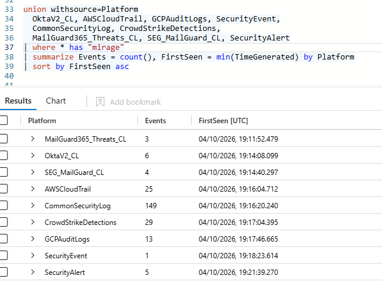
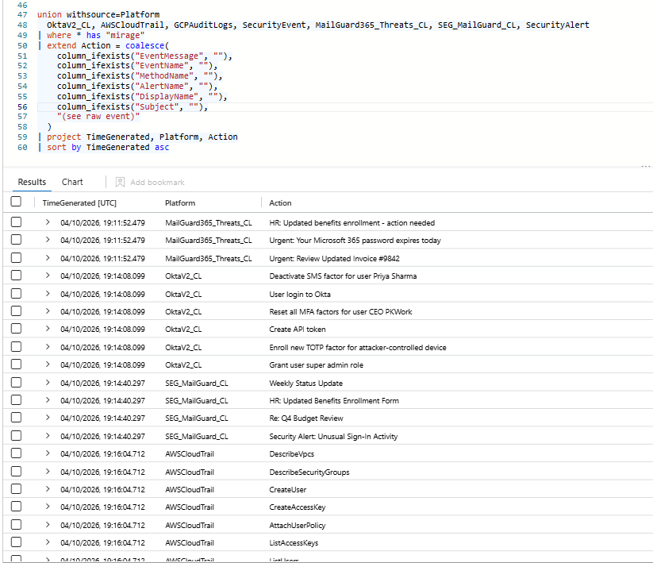
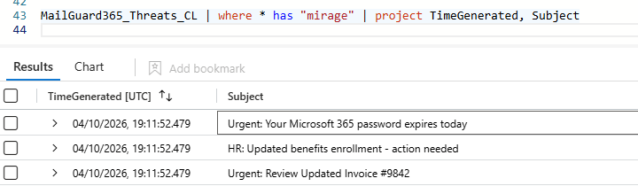
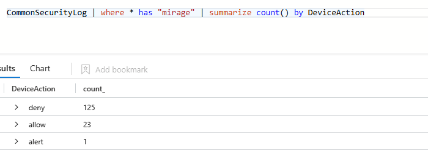

# Multi-Platform Attack Campaign Reconstruction: Mail → Identity → Multi-Cloud → Endpoint

**Platform:** Microsoft Sentinel · KQL (`search`, `union`, `coalesce`, `summarize`)
**Domain:** Threat Hunting · Incident Reconstruction · Detection-coverage analysis
**Detection surface:** Microsoft Sentinel (Defender portal) — 10 data sources

---

## The problem — a real-world attack, not a hypothetical

Modern intrusions are not confined to one system. A single threat actor moves fluidly across email, identity providers, multiple clouds, the network, and endpoints within minutes — a pattern seen in the **2023 Scattered Spider (UNC3944)** campaigns against MGM and Caesars, where the attacker phished an identity, pivoted into cloud consoles, created backdoor accounts, stole data, and disabled logging to slow responders. [1][2]

The defensive failure these attacks exploit is twofold. First, **single-source analysis** — each platform logs only its own slice, so an analyst watching one tool sees one fragment. Second, and more dangerous, is the **detection-coverage gap**: a SOC may have a detection for one late-stage action (e.g. log clearing) while the entire earlier campaign — the phishing, the identity takeover, the cloud compromise — generates no alert at all. The attack is "detected," but only after the damage is done, and only in part.

This project reconstructs exactly such a campaign end to end, across **ten data sources**, and quantifies the detection gap.

## What this project is — and the skills it proves

This is a full **campaign reconstruction** in Microsoft Sentinel. Starting from a single actor name, it discovers every data source the actor touched, inspects each to locate the relevant fields, and unifies them into one chronological timeline — then analyses where detection succeeded and, more importantly, where it did not.

| Real-world failure | Capability this project builds |
|---|---|
| Single-source analysis misses a multi-platform campaign | Unify 10 data sources into one actor-centric timeline |
| Analyst doesn't know where the evidence lives | A repeatable discover → inspect → unify SIEM method |
| "It's detected" hides that most stages were missed | Detection-coverage gap analysis across the kill chain |
| Noise (firewall floods) buries the signal | Summarising high-volume sources instead of drowning in rows |

---

## The method — how a real SIEM investigation actually works

A clean timeline is not handed to you; it is built. The process used here is the same one that applies to any SIEM and any data you have never seen before:

1. **Discover** — find every table the actor appears in.

   ```kql
   search "mirage"
   | distinct $table
   ```

   

2. **Inspect** — open each table and identify *which column holds the useful information* (Okta → `EventMessage`, AWS → `EventName`, GCP → `MethodName`, mail → `Subject`, SecurityAlert → `AlertName`). The evidence lives in a different column in every source.

3. **Unify** — stack the relevant fields into one timeline and sort by time.

This discover → inspect → unify loop is the core transferable skill: you cannot query what you have not located, so you map the data before you assemble the story.

---

## The campaign timeline

A summarised union across all nine action-bearing sources (asset-inventory table excluded) produces the campaign arc — each platform, its event volume, and when the actor first touched it:

```kql
union withsource=Platform
  OktaV2_CL, AWSCloudTrail, GCPAuditLogs, SecurityEvent,
  CommonSecurityLog, CrowdStrikeDetections,
  MailGuard365_Threats_CL, SEG_MailGuard_CL, SecurityAlert
| where * has "mirage"
| summarize Events = count(), FirstSeen = min(TimeGenerated) by Platform
| sort by FirstSeen asc
```



| # | Time (first seen) | Platform | Events | Kill-chain stage |
|---|---|---|---|---|
| 1 | 19:11:52 | MailGuard365 | 3 | **Initial Access** — phishing |
| 2 | 19:14:08 | Okta | 6 | **Identity takeover** |
| 3 | 19:14:40 | SEG MailGuard | 4 | Mail (lures + system alert emails) |
| 4 | 19:16:04 | AWS CloudTrail | 25 | **Cloud compromise (AWS)** |
| 5 | 19:16:20 | CommonSecurityLog | 149 | **Network** — C2 / traffic |
| 6 | 19:17:04 | CrowdStrike | 29 | **Endpoint** — EDR detections |
| 7 | 19:17:46 | GCP AuditLogs | 13 | **Cloud compromise (GCP)** |
| 8 | 19:18:23 | SecurityEvent | 1 | **Anti-forensics** — Windows log cleared |
| 9 | **19:21:39** | SecurityAlert | 5 | 🚨 **First detection** |

---

## Stage-by-stage reconstruction

A detailed union (`coalesce` across each source's action column) surfaces the actual actions in sequence:



**1 — Initial Access (MailGuard365, 19:11:52).** Three phishing lures delivered — textbook credential-and-invoice bait:



- *"Urgent: Your Microsoft 365 password expires today"* — credential phish
- *"HR: Updated benefits enrollment - action needed"* — HR-themed lure
- *"Urgent: Review Updated Invoice #9842"* — invoice-fraud lure

**2 — Identity Takeover (Okta, 19:14:08).** Login → grant super-admin → create API token → enrol attacker-controlled TOTP → reset the CEO's MFA → deactivate Priya Sharma's SMS factor. Two separate victims (the CEO and Priya Sharma); the API token and planted MFA establish persistence that survives a password reset.

**3 — Cloud Compromise, AWS (19:16:04).** ConsoleLogin → reconnaissance (`DescribeVpcs`, `DescribeSecurityGroups`, `ListAccessKeys`) → persistence (`CreateUser`, `CreateLoginProfile`, `CreateAccessKey`) → privilege escalation (`AttachUserPolicy` → AdministratorAccess) → data theft (`GetObject`) → resource abuse (`RunInstances`) → **anti-forensics (`StopLogging`, `DeleteTrail`)** → network exposure (`AuthorizeSecurityGroupIngress`).

**4 — Network (CommonSecurityLog, 19:16:20).** 149 firewall events: **125 deny, 23 allow, 1 alert**. The lone `alert` is a malware/spyware detection in the traffic — the network sensor catching what the other layers did not.



**5 — Endpoint (CrowdStrike, 19:17:04).** 29 EDR detections fired on the host as the attacker operated on the endpoint.

**6 — Cloud Compromise, GCP (19:17:46).** A *second* cloud: `storage.objects.get` (data theft) → `SetIamPolicy` (privilege escalation) → `CreateServiceAccount` + `CreateServiceAccountKey` (persistence) → **`DeleteSink` / `UpdateSink` (disabling cloud logging)** → `compute.instances.insert` + `firewalls.insert`.

**7 — Anti-forensics, Endpoint (SecurityEvent, 19:18:23).** Event ID 1102 — the Windows security log cleared, the attacker's final cover-up.

**8 — Detection (SecurityAlert, 19:21:39+).** The first alert fires: *"NRT Security Event log cleared"*, followed by AWS CloudTrail-stopped and Config-deletion alerts.

---

## The key finding — a detection-coverage gap

The campaign began at **19:11:52** and the first alert fired at **19:21:39** — a window of **~9 minutes 47 seconds**. But the dwell time is not the real story; the **coverage gap** is.

Of the eight attack stages, the SOC's detections fired on only the **anti-forensic tail** — the Windows log clearing, and later the AWS logging/Config tampering. The phishing, the identity takeover, the AWS compromise, the network activity, the endpoint detections, and the entire GCP compromise generated **no Sentinel incident at the time**. The attacker disabled logging on three platforms (AWS `DeleteTrail`, GCP `DeleteSink`, Windows 1102), and it was only the clumsiest of those — clearing the Windows log — that tripped a rule.

**In short: the campaign was not detected as it unfolded; it was detected at the moment the attacker tried to hide it.** Everything before the cover-up was a blind spot. That is a detection-engineering finding, not just an IR one — it names precisely which stages need new detections.

---

## Honest note on timestamp ordering

Events *within* a single platform share one timestamp (e.g. all six Okta events are stamped 19:14:08.099), so **cross-platform ordering is reliable (by first-seen), but intra-platform ordering is not** derivable from the data. The within-stage sequence above (e.g. login before super-admin grant) is reconstructed from logical attack flow, not from raw timestamps. This is a property of the lab dataset; a production environment with sub-second precision would order within-stage actions directly.

---

## MITRE ATT&CK mapping

| Stage | Tactic | Technique |
|---|---|---|
| Phishing | Initial Access | T1566 – Phishing |
| Okta login | Initial Access | T1078 – Valid Accounts |
| Okta super-admin | Privilege Escalation | T1098.003 – Account Manipulation: Additional Cloud Roles |
| Okta API token | Persistence | T1098.001 – Additional Cloud Credentials |
| Okta TOTP enrol | Persistence | T1098.005 – Device Registration |
| Okta SMS deactivation | Credential Access / Defense Evasion | T1556.006 – Modify Authentication Process: MFA |
| CEO MFA reset | Impact | T1531 – Account Access Removal |
| AWS recon | Discovery | T1580 – Cloud Infrastructure Discovery |
| AWS backdoor user | Persistence | T1136.003 – Create Account: Cloud Account |
| AWS StopLogging/DeleteTrail | Defense Evasion | T1562.008 – Impair Defenses: Disable or Modify Cloud Logs |
| AWS GetObject / GCP storage.get | Collection | T1530 – Data from Cloud Storage |
| AWS RunInstances / GCP instances.insert | Impact | T1496 – Resource Hijacking |
| GCP SetIamPolicy | Privilege Escalation | T1098 – Account Manipulation |
| GCP DeleteSink | Defense Evasion | T1562.008 – Disable or Modify Cloud Logs |
| Windows 1102 | Defense Evasion | T1070.001 – Indicator Removal: Clear Windows Event Logs |

---

## Key design decisions

- **Discover before you assemble.** The investigation starts with `search "mirage" | distinct $table` — you cannot build a timeline across sources you have not located. The method is deliberately repeatable for any actor and any dataset.
- **Summarise high-volume sources; don't drown in them.** The 149-row firewall flood is reduced to a 3-row action breakdown (deny/allow/alert), keeping the one signal (the malware alert) visible instead of buried.
- **Exclude noise, keep signal.** The asset-inventory table (a single host record, no action) is excluded; action-bearing sources are kept.
- **Cross-platform order is trusted; intra-platform order is reconstructed and labelled as such** — stating the data's limitation rather than implying precision it does not have.
- **The real output is a coverage gap, not just a timeline.** The analysis names which kill-chain stages produced no alert — turning an incident reconstruction into a detection-engineering backlog.

---

## Future improvements

- **Build detections for the blind-stage activity** — analytics rules for the phishing delivery, the Okta super-admin grant, the AWS/GCP backdoor-account creation, so future campaigns are caught early rather than at the cover-up.
- **Enrich CrowdStrike actions** — map the EDR detection-name column so the 29 endpoint detections surface by name in the timeline rather than as a count.
- **Correlate failure-to-detection latency per stage** — measure how long each stage ran before any alert, to prioritise which detections close the largest gaps.
- **Promote to a scheduled correlation rule** — a rule that raises a single high-severity incident when one identity appears across cloud, endpoint, and anti-forensic events in a short window.

---

## Skills demonstrated

Multi-source campaign reconstruction · SIEM investigation method (discover → inspect → unify) · KQL `search`, `union withsource`, `coalesce`, `column_ifexists`, `summarize` · cross-platform correlation · detection-coverage gap analysis · high-volume data summarisation · honest treatment of data limitations · MITRE ATT&CK mapping across the full kill chain

---

## References

1. Reuters — [MGM Resorts says cyberattack could cost it $100 million](https://www.reuters.com/technology/mgm-resorts-says-cyberattack-could-cost-it-100-million-2023-10-05/) (October 2023).
2. CISA — [Scattered Spider (Alert AA23-320A)](https://www.cisa.gov/news-events/cybersecurity-advisories/aa23-320a) — phishing-to-cloud TTPs including cloud account creation, data theft, and defense evasion.
